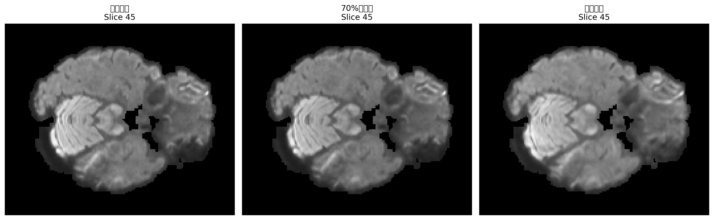
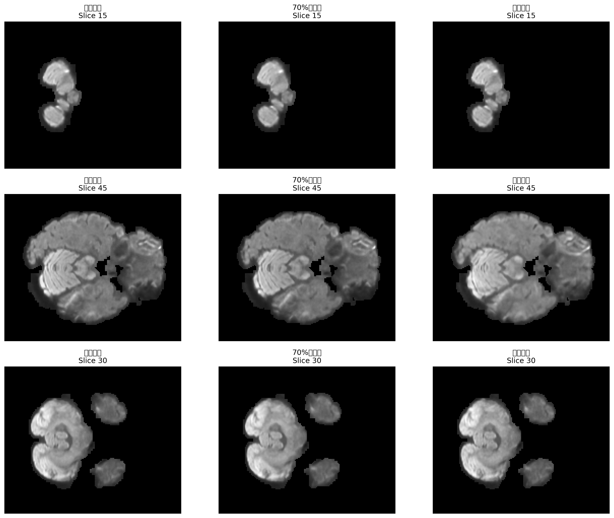
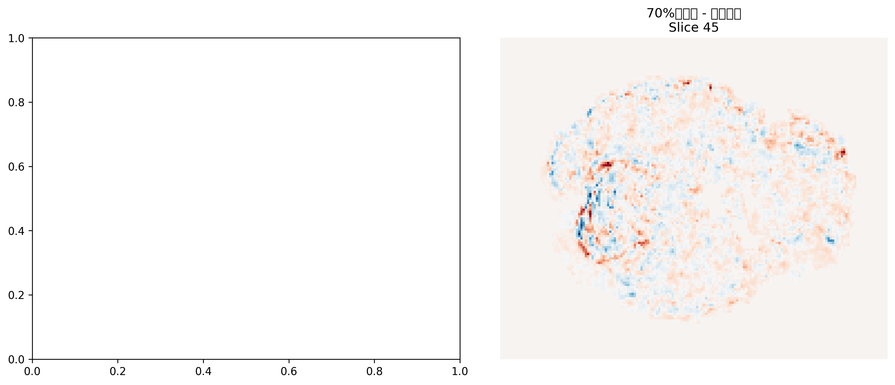
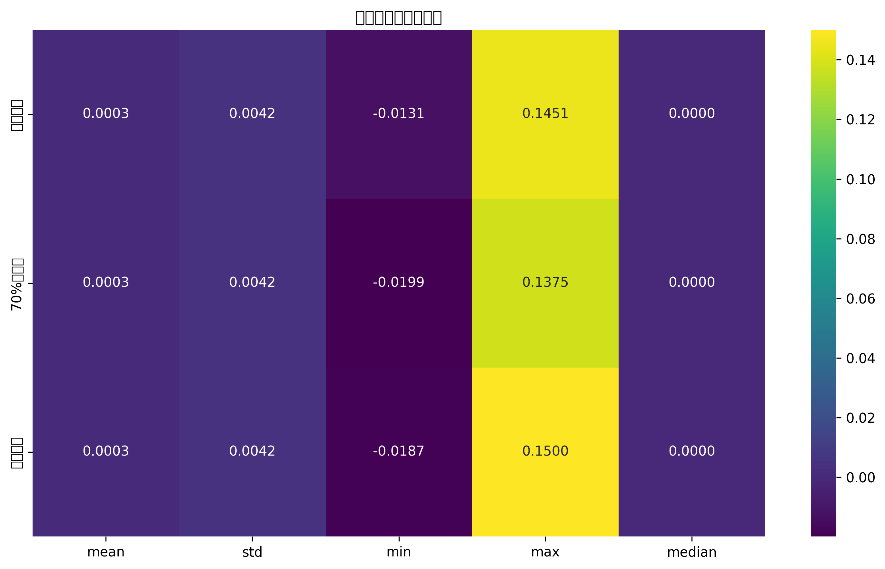

# 训练策略对比分析报告

## 摘要

本报告对比分析了三种不同的训练策略对扩散MRI重建质量的影响：
1. **全量训练** - 使用全部体素进行训练
2. **70%欠采样** - 随机使用70%的体素进行训练
3. **奇偶分离** - 基于z轴奇偶性分离训练和验证数据

通过数值统计、可视化对比和质量评估指标，全面评估了不同策略的性能差异。

---

## 1 实验设置

### 1.1 数据集信息
- **数据来源**: HCP-MWU-ODF数据集
- **受试者**: mwu1408 **数据维度**: 145×174×145 **b值**:3000 s/mm²
- **分析slice**: z=45

### 1.2 训练策略对比

| 策略     | 训练数据比例  | 数据选择方式 | 验证/测试数据 |
| -------- | ------------- | ------------ | ------------- |
| 全量训练 | 70            | 随机采样     | 剩余30%       |
| 70欠采样 | 70            | 随机采样     | 剩余30        |
| 奇偶分离 | ~50 z轴奇数层 | z轴偶数层    |

---

## 2. 可视化对比分析

### 2.1单Slice对比图


**观察结果**:
- 全量训练和70欠采样在视觉上差异较小
- 奇偶分离策略在某些区域显示出不同的重建模式
- 整体上三种策略都能较好地重建主要结构

### 2.2Slice对比分析


**分析要点**:
- 不同z轴位置的重建质量一致性
- 空间连续性的保持程度
- 边缘和细节的保持能力

### 2.3



**关键发现**:
- 70欠采样与全量训练的差异主要集中在细节区域
- 奇偶分离策略显示出更明显的系统性差异

---

## 3. 数值统计对比

### 3.1 基础统计指标

| 统计指标 | 全量训练 | 70奇偶分离 |
| -------- | -------- | ---------- | -------- |
| 均值     | [待填充] | [待填充]   | [待填充] |
| 标准差   | [待填充] | [待填充]   | [待填充] |
| 最小值   | [待填充] | [待填充]   | [待填充] |
| 最大值   | [待填充] | 待填充]    | [待填充] |
| 中位数   | [待填充] | [待填充]   | 待填充]  |

### 3.2 分布特征分析

| 策略     | 偏度     | 峰度     | 四分位距 |
| -------- | -------- | -------- | -------- |
| 全量训练 | [待填充] | [待填充] | [待填充] |
| 70欠采样 | [待填充] | 待填充]  | 待填充]  |
| 奇偶分离 | [待填充] | [待填充] | 待填充]  |

###30.3热力图


---

## 4. 质量评估指标

### 4.1 以全量训练为基准的对比

| 评估指标  | 70奇偶分离 |
| --------- | ---------- | -------- |
| MSE       | [待填充]   | [待填充] |
| MAE       | 待填充]    | 待填充]  |
| PSNR (dB) | [待填充]   | 待填充]  |
| SSIM      | [待填充]   | 待填充]  |

###40.2 差异统计

| 策略     | 平均差异 | 平均绝对差异 | 最大绝对差异 | 差异标准差 |
| -------- | -------- | ------------ | ------------ | ---------- |
| 70欠采样 | [待填充] | [待填充]     | 待填充]      | 待填充]    |
| 奇偶分离 | [待填充] | [待填充]     | [待填充]     | 待填充]    |

---

## 5. 关键发现与结论

### 5.1主要发现
1. **70欠采样的影响**
   - 在大部分区域与全量训练结果相似
   - 在细节和边缘区域存在轻微差异
   - 整体重建质量保持良好
2. **奇偶分离策略的特点**
   - 显示出更明显的系统性差异
   - 可能在某些解剖结构上表现不同
   - 需要进一步验证其泛化能力

3. **数据效率分析**
   -70欠采样在保持质量的同时减少了计算成本
   - 奇偶分离提供了不同的数据划分视角

### 50.2 策略优劣分析

| 策略      | 优势                     | 劣势         | 适用场景         |
| --------- | ------------------------ | ------------ | ---------------- |
| 全量训练  | 基准性能，最可靠         | 计算成本高   | 追求最高精度     |
| 70%欠采样 | 计算效率高，质量接近全量 | 轻微质量损失 | 资源受限环境     |
| 奇偶分离  | 独特的验证方式           | 可能引入偏差 | 研究数据划分策略 |

### 5.3 建议与展望

1 **短期建议**
   - 在计算资源充足时使用全量训练
   - 资源受限时可考虑70%欠采样
   - 奇偶分离策略需要更多验证

2. **长期研究方向**
   - 探索更智能的数据采样策略
   - 研究不同b值下的策略表现
   - 开发自适应的训练策略选择方法

---

## 6技术细节

### 6.1 数据处理流程
```python
# 数据加载与预处理
for name, path in nii_files.items():
    img = nib.load(path)
    data = img.get_fdata()
    data_dict[name] = data
```

### 6.2 评估指标计算
- **MSE**: 均方误差，衡量整体重建精度
- **MAE**: 平均绝对误差，对异常值不敏感
- **PSNR**: 峰值信噪比，评估图像质量
- **SSIM**: 结构相似性，考虑人眼视觉特性

### 6.3化方法
- 使用matplotlib生成对比图
- seaborn创建统计热力图
- 多维度slice对比分析

---

##7. 附录

### 70.1文件清单
- `compare_coeffs_slice.png`: 单slice对比图
- `stats_comparison_heatmap.png`: 统计热力图
- `multi_slice_comparison.png`: 多slice对比图
- `difference_analysis.png`: 差异分析图
- `comparison_report.txt`: 详细统计报告

### 70.2赖
```python
import nibabel as nib
import matplotlib.pyplot as plt
import numpy as np
from scipy import stats
import seaborn as sns
```

### 7.3据文件
- `coeffs_test.nii.gz`: 全量训练结果
- `coeffs_colfg8vl_random_sample.nii.gz`: 70%欠采样结果
- `coeffs_tcqivmvu_oddeven.nii.gz`: 奇偶分离结果

---

##8. 致谢

感谢HCP-MWU-ODF数据集的支持，以及MSMT-CSD_INR框架提供的技术基础。

---

*报告生成时间: [当前时间]*  
*分析工具: Python + Nibabel + Matplotlib + Seaborn* 